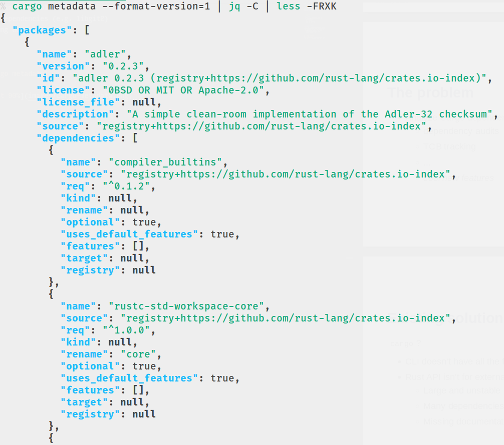
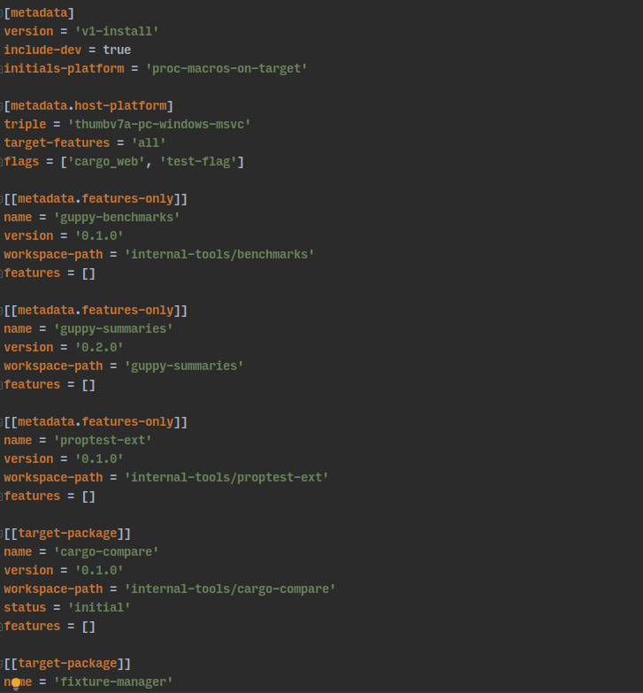
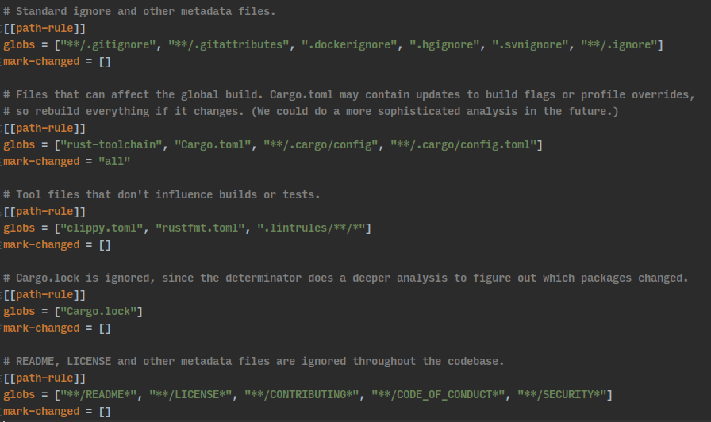
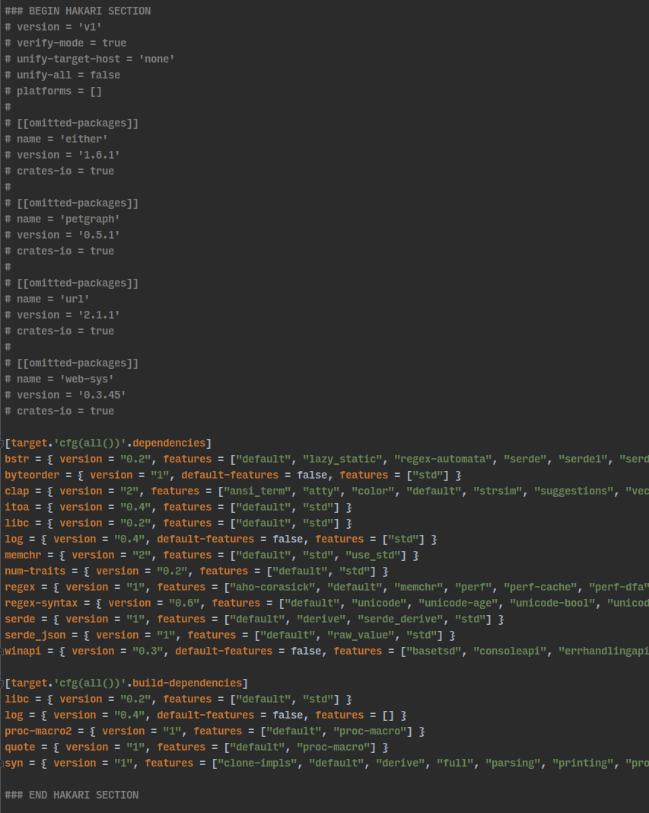

<!-- _class: invert -->
<!-- _footer: 'February 2021' -->

# cargo-guppy
track and query Cargo dependencies
###### Rain \<rain1@fb.com\>

---

<!-- paginate: true -->

# The problem

* Analyze Cargo dependency graphs for:
  * license checks
  * dependency audits
  * TCB tracking
  * ...
  * *cool new features*

---

# Existing solutions

`cargo`?
* CLI doesn't have all the features we want
* Rust API isn't for external consumption
  * Large and unstable
  * Many dependencies (e.g. libgit2)
  * Missing documentation

---

# But...

`cargo metadata` has:
* package information
* dependency information
* everything we need



---

<!-- _class: invert -->

# Enter guppy

* Read `cargo metadata` input
* Parse as graph structure
* Present nice APIs

---

# The package graph

* Central structure is `PackageGraph`
* Nodes are packages, edges are dependencies
* Directed, may be cyclic (dev-dependencies)
* Most other types borrow from `PackageGraph`
  * Indicated with a `'g` lifetime
* Uses `petgraph` with integer indexes internally
* Maps integers to borrowed structures externally
* Immutable + `Send` + `Sync` means easy parallelization

---

# The feature graph

* `FeatureGraph<'g>` is a second, auxiliary graph built from `PackageGraph`
* Nodes are `(package, feature)` pairs, edges are either:
  * Feature dependencies, e.g. `foo = ["bar", "baz"]`
  * Cross-links, e.g. `dep = { version = "1", features = ["foo"] }
* Computed on-demand

---

# Core types

| Abstraction | Package type | Feature type
| :-: | :-: | :-: |
| Main graph | `PackageGraph` | `FeatureGraph<'g>`
| Identifier | `PackageId` | `FeatureId<'g>`
| Extended information | `PackageMetadata<'g>` | `FeatureMetadata<'g>`
| Dependency edge triple | `PackageLink<'g>` | `CrossLink<'g>`*
| Dependency query | `PackageQuery<'g>` | `FeatureQuery<'g>`
| Query result | `PackageSet<'g>` | `FeatureSet<'g>` 

\* currently only cross-links are exposed, eventually `FeatureLink<'g>`

---

# Core methods

| from | to | method |
| :-: | :-: | :-: |
| `Graph` | `Metadata` | `metadata` |
| `Metadata` | `Link` iterator | `direct_links_` |
| `Graph` | `Query` | `query_` |
| `Graph` or `Query` | `Set` | `resolve_` |
| `Set` | `Metadata` | `packages` or `features` |
| `Set` | `Link` iterator | `links` |

`_` indicates that it's several methods, e.g. `query_forward`, `query_reverse` and `query_directed`

---

# Switching between graphs

| abstraction | p ➡ f | f ➡ p |
| :-: | :-: | :-: |
| `Graph` | `feature_graph` | `package_graph` |
| `Query` | `to_feature_query` | `to_package_query` |
| `Set` | `to_feature_set` | `to_package_set` |

Package ➡ feature requires a `FeatureFilter`. Most people will use `StandardFeatures::None`, `Default` or `All`.

---

# Filtering during traversals

* Get all transitive dependencies: `PackageQuery::resolve`
* But what if you don't want to follow all edges?
* `PackageQuery::resolve_with()` accepts a `PackageResolver<'g>`
  * Trait with `fn accept(query, link) -> bool`
* Also available as a callback: `PackageQuery::resolve_with_fn`
* Also available for `FeatureQuery`

---

<!-- _class: invert -->
<!-- _paginate: false -->

# Applications

---

# Basic traversals

- Get all transitive dependencies: `query.resolve()`
- Ignore dev-only dependencies:
`query.resolve_with_fn(|_, link| !link.dev_only())`
- Direct dependencies of workspace:

```rust
query.resolve_with_fn(|_, link| {
    let (from, to) = link.endpoints();
    from.in_workspace() && !to.in_workspace()
})
```

---

# Cargo builds

* Which packages and features will a build command include?
* Start from a `FeatureSet` describing initials
* Traverse dependency graphs the same way Cargo would
* Customize behavior through `CargoOptions`
  * Platforms and more



---

# Cargo builds: v1 and v2 resolvers

* v1 (classic) resolver
  * Packages may or may not be enabled depending on dev, features or platforms
  * Feature resolution is *independent of* which packages are enabled
  * Simulated through 1 feature query + 2 package queries
    * One package query for the target platform, one for the host
* v2 (new) resolver
  * Packages may or may not be enabled depending on dev, features or platforms
  * Feature resolution is *dependent on* which packages are enabled
  * Simulated through 2 feature queries + 2 package queries
    * One each for the target, one each for the hos

---

# Cargo builds: property testing

* Comparison testing with Cargo
  * Generate random queries and compare against Cargo
* Consistency testing with previous versions of guppy
  * Generate random queries and simulate builds
  * Summaries with build results checked into the repo
  * These should only change if there's a good reason

---

<!-- _class: invert -->
<!-- _paginate: false -->

# Cool new features

---

# Determinator

* Only run tests for packages that changed from upstream
* Given old metadata, new metadata and paths changed:
  * Map each path to a package
  * Simulate Cargo builds for each package and see which changed
* Support for custom rules
* Diem CI: p25 90% faster, p50 60+%
* [docs.rs/determinator](https://docs.rs/determinator)



---

<!-- _paginate: false -->

# Hakari

* Manage packages for dependency feature unification
  * Workspace-hack packages used by many large projects (rustc, Firefox, Diem)
* Simulate Cargo builds and look for non-workspace packages built with more than one feature set
* Speeds up Diem builds by 15-30% or more
* [docs.rs/hakari](https://docs.rs/hakari)



---

<!-- _class: invert -->
<!-- _paginate: false -->

# Questions?
